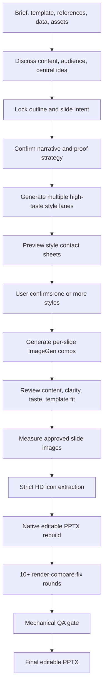
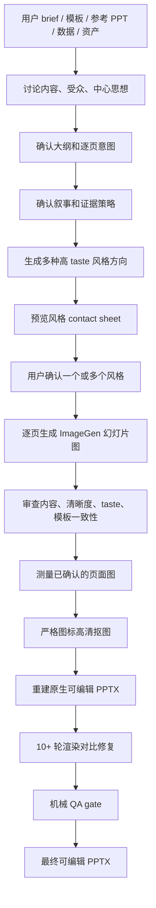

# ImageGen PPTX Pipeline

[](https://github.com/eddyzzl/imagegen-pptx-pipeline/actions/workflows/ci.yml)

**ImageGen PPTX Pipeline** is an agent skill for creating high-taste, editable PowerPoint decks from rough ideas, outlines, templates, reference decks, data, brand assets, generated slide comps, or user-supplied final slide images.

It is designed for the hard version of deck generation: not only making slides that look good, but helping an agent discuss the story, lock the central message, confirm every page, explore multiple visual directions, generate slide images, and convert those images into faithful editable PPTX with strict native reconstruction, HD icon extraction, and real render QA.

[中文说明](#中文说明)

## Why It Is Powerful

- **Multi-round deck thinking:** discuss content, audience, central idea, outline, narrative arc, proof strategy, and slide-by-slide intent before drawing anything.
- **Page-by-page confirmation:** lock titles, claims, evidence, visual intent, text sources, and conversion plans through stateful files such as `deck_spec.json`, `slide_intent_matrix.md`, `narrative_matrix.md`, `visual_contract.json`, and `conversion_manifest.json`.
- **High-taste visual direction:** choose from concrete style IDs in `references/style-library.md`, generate multiple materially different visual lanes, preview contact sheets, and let the user confirm one or more directions before full production.
- **Parallelizable production and review:** supports page-level subagents and specialist reviewers for conversion feasibility, typography, visual fidelity, icon extraction, template fidelity, and final export decisions when the runtime supports multi-agent work.
- **Image-to-editable-PPTX conversion:** treats generated or supplied slide images as measurement targets, then rebuilds the slide with native PowerPoint text, shapes, connectors, charts, tables, and only validated image assets.
- **HD icon extraction:** `iconcut3.py` fails closed on clipped icons, extracts real source pictograms instead of redrawing generic glyphs, supersamples/sharpens icons before PPTX placement, and preserves feathered alpha for fused art slices.
- **Real QA instead of self-reporting:** `qa_gate.py` reads actual PPTX XML/media, real render files, icon manifests, and region metrics. Final conversion requires at least 10 real render-compare-fix rounds with distinct exported render files.

## Workflow



## What It Is For

- Product, company, model/technical, sales, GTM, strategy, investor, training, and internal review decks.
- Decks that need a real narrative and central argument, not just pretty pages.
- Decks that need several high-taste visual directions before authoring.
- Decks that must preserve a supplied PowerPoint template.
- CJK-heavy slides where text wrapping, icon clipping, and visual drift matter.
- Slide images, screenshots, or mockups that must become faithful editable PPTX.

## Core Workflow

1. Read the user brief, template, historical decks, sources, and assets.
2. Lock `deck_spec.json` as the content source of truth.
3. Confirm each slide's title, core idea, proof goal, and evidence strategy in `slide_intent_matrix.md`.
4. Confirm narrative treatment in `narrative_matrix.md`.
5. Generate materially different ImageGen contact-sheet directions using concrete style IDs from `references/style-library.md`.
6. Let the user choose one or multiple visual directions unless full automation was explicit.
7. Generate one independent high-resolution ImageGen comp for every slide in each selected style.
8. Review comps for content, style continuity, visual clarity, template fidelity, and PPTX feasibility.
9. Lock `visual_contract.json` and `conversion_manifest.json`.
10. Convert slide images into editable PPTX using measured 1920x1080 basis coordinates, strict HD icon extraction/enhancement, native `slidelib.py` shapes/text, and 10+ real render-compare-fix rounds verified by `qa_gate.py`.
11. Run final council review before export.

For direct image conversion, content/narrative/style generation is skipped. User-supplied per-slide images are registered in `conversion_manifest.json` and converted with the same strict converter.

## Repository Layout

```text
imagegen-pptx-pipeline/
  README.md
  LICENSE
  COMPATIBILITY.md
  CONTRIBUTING.md
  CHANGELOG.md
  SECURITY.md
  imagegen-pptx-pipeline/
    SKILL.md
    slidelib.py
    iconcut3.py
    qa_gate.py
    PITFALLS.md
    agents/openai.yaml
    references/
    scripts/
  examples/
  tests/
```

The installable skill is the inner `imagegen-pptx-pipeline/` directory.

## Installation

```bash
mkdir -p "$CODEX_HOME/skills"
cp -R imagegen-pptx-pipeline "$CODEX_HOME/skills/imagegen-pptx-pipeline"
```

If `CODEX_HOME` is not set, use the skill directory supported by your agent runtime.

## Minimal Usage

```text
Use $imagegen-pptx-pipeline to create a 10-slide product launch deck.

Inputs:
- Brief: ...
- Audience: executive product review
- Template: attached PPTX
- References: attached historical deck
- Style directions: 4

First confirm slide_intent_matrix.md, then narrative_matrix.md, then generate ImageGen style options.
```

Direct image conversion:

```text
Use $imagegen-pptx-pipeline to convert these final slide images into a faithful editable PPTX.
Use strict HD icon extraction and run at least 10 render-compare rounds, each with a new exported render file.
```

## Required Capabilities

The full workflow expects:

- ImageGen/Image2-style image generation for contact sheets and per-slide comps.
- Python 3 with `Pillow`, `numpy`, and `python-pptx`.
- LibreOffice `soffice`.
- Poppler `pdftoppm`.
- Image viewing for paired crops and icon contact sheets.
- Optional `markitdown` for text QA.
- Optional subagents for parallel production and specialist review.

Without ImageGen, the skill can still run direct slide-image conversion from user-supplied images. Without LibreOffice/Poppler or image viewing, it cannot complete the strict render-compare loop.

## Validation

Run smoke tests:

```bash
python -m unittest discover -s tests
```

Run the gate checker manually:

```bash
python imagegen-pptx-pipeline/scripts/check_pipeline_gates.py \
  --workspace /path/to/workspace \
  --stage before-pptx
```

## Local Codex Sync

Treat this repository as the source of truth. For local development, prefer a symlink:

```bash
mkdir -p ~/.codex/skills
ln -sfn "$PWD/imagegen-pptx-pipeline" ~/.codex/skills/imagegen-pptx-pipeline
```

For runtimes that do not support symlinked skills:

```bash
tools/sync-to-codex.sh --dry-run
tools/sync-to-codex.sh
```

## Design Principles

- Generated images are visual targets, not the source of truth for text or data.
- Final text and numbers come from `deck_spec.json`.
- User-supplied templates are hard constraints.
- Style options must differ by visual system, not just color.
- ImageGen prompts should request crisp text, sharp icons, clean fine lines, and the highest available detail.
- Blurry titles, unreadable key numbers, muddy icons, soft fine lines, or compression artifacts are blockers unless accepted by the user.
- PPTX conversion uses measurement, not eyeballing.
- Full-slide and large region image layers are not the conversion path.
- Text, numbers, labels, cards, lines, charts, arrows, tables, and page chrome should be native editable PowerPoint objects.
- Complex icons are extracted and HD-enhanced with `iconcut3.py`; ClipError means fix the measurement, not bypass the extractor.
- Every extracted icon needs both a 4-edge alpha audit and a visual contact-sheet audit.
- Multi-line CJK text and mixed-size numeric runs should be split into absolute text boxes.
- Final decks require at least 10 render-compare-fix rounds with distinct render files, paired crops, real region metrics, and passing `qa_gate.py` media/round/metric audits.
- Every user pause is stateful through `pipeline_state.json`.

# 中文说明

**ImageGen PPTX Pipeline** 是一个用于生成高质量、可编辑 PowerPoint 的 Codex/Agent skill。它不只是“把文字塞进 PPT 模板”，而是把一个专业 PPT 顾问、视觉总监、逐页审稿人、图片生成器、图片转 PPTX 工程师和 QA 审计员串成一条可暂停、可确认、可追踪的工作流。

它可以从粗略想法、提纲、模板、参考 PPT、品牌资料、数据、生成图，或者用户已经给好的幻灯片图片出发，逐步讨论内容、明确中心思想、确认大纲、逐页确认页面意图，选择多种高 taste 视觉风格，预览风格方向，确认后再逐页生成图片，最后把图片严格转换成真正可编辑的 PPTX。

## 它强在哪里

- **可以多轮讨论内容和中心思想：**先聊清楚受众、目标、核心论点、叙事结构、证据策略，再开始做视觉。
- **可以逐页确认内容：**每页的标题、主张、证明对象、关键信息、视觉意图、文字来源和转换方案都会被写进状态文件，避免边做边丢信息。
- **可以选择多种高 taste 风格：**内置 `references/style-library.md`，不是只换颜色，而是生成多条真正不同的视觉方向，包括版式语法、材质、密度、字体气质、图表语言和图标语言。
- **可以预览并确认风格：**先生成风格 contact sheet，让用户选一个或多个方向，再进入完整逐页生成。
- **可以支持多子 agent 并行：**在支持多 agent 的运行时里，可以按页面或角色拆分生产和审查，例如视觉保真、PPTX 可行性、文字排版、图标抠图、模板一致性、最终导出评审等。
- **可以把图片转成可编辑 PPTX：**生成图或用户给的截图只作为测量目标，最终 PPTX 需要重建为原生 PowerPoint 文本、形状、线条、图表、表格和连接器，而不是铺一张整页背景图。
- **可以做图标高清抠图：**`iconcut3.py` 会严格抠真实图标，遇到裁切风险直接失败，不偷偷交付坏图；抠出的图标会做 256px 级别的高清化、超采样和锐化，再贴进 PPTX。
- **可以保护复杂图标边缘：**对徽章、融合背景的图形、羽化切片，会保留柔和 alpha，避免高清锐化后出现方形边。
- **可以做真实 QA：**`qa_gate.py` 会读取真实 PPTX XML、媒体文件、图标 manifest、真实渲染图和区域差异指标。最终要求至少 10 轮真实导出、对比、修复，而不是口头说“看起来差不多”。

## 中文工作流



## 适合什么场景

- 产品介绍、公司介绍、模型/技术方案、销售/GTM、战略汇报、投融资、培训、内部评审等 PPT。
- 需要先讲清楚叙事和中心论点，而不是直接生成漂亮页面的 PPT。
- 需要多种高质量视觉风格供选择的 PPT。
- 需要严格保留用户提供模板的 PPT。
- 中文/CJK 内容很多、文字换行和图标细节容易出错的 PPT。
- 已经有幻灯片图片、截图、mockup，但需要转换成可编辑 PPTX 的场景。

## 中文最小用法

```text
使用 $imagegen-pptx-pipeline 帮我做一个 10 页产品发布会 PPT。

输入：
- Brief: ...
- 受众：产品/管理层评审
- 模板：已上传 PPTX
- 参考：已上传历史 deck
- 风格方向：4 个

先确认 slide_intent_matrix.md，再确认 narrative_matrix.md，然后生成 ImageGen 风格选项。
```

直接图片转 PPTX：

```text
使用 $imagegen-pptx-pipeline 把这些最终幻灯片图片转换成高保真、可编辑 PPTX。
需要严格高清图标抠图，并至少跑 10 轮真实渲染对比修复。
```

## 中文安装

```bash
mkdir -p "$CODEX_HOME/skills"
cp -R imagegen-pptx-pipeline "$CODEX_HOME/skills/imagegen-pptx-pipeline"
```

如果没有设置 `CODEX_HOME`，请使用你的 agent 运行时支持的 skill 目录。可安装的 skill 是仓库内层的 `imagegen-pptx-pipeline/` 目录。

## 中文验证

```bash
python -m unittest discover -s tests
```

手动运行 gate：

```bash
python imagegen-pptx-pipeline/scripts/check_pipeline_gates.py \
  --workspace /path/to/workspace \
  --stage before-pptx
```
